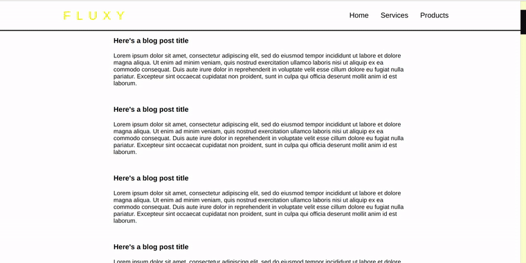

## Show Navbar when scroll up and hide Navbar when scroll down.

<br>

[](https://nadiamariduena.github.io/react-hide-show-onscroll/)

<br>

~~No copyright infringement intended, All pictures used in this exercise are **_only_** for educational purposes.~~

<br>

<p>
Preview of what i used to make the effect work:
</p>

<br>

```javascript

componentDidMount() {
    window.addEventListener("scroll", this.handleScroll);
  }
  componentWillUnmount() {
    window.removeEventListener("scroll", this.handleScroll);
  }
  handleScroll = () => {
   /* getBoundingClientRect , will get the size and the position of the div,
    you need it for when the user will scroll: getBoundingClientRect().top > this.state.scrollPos, */
    this.setState({
      scrollPos: document.body.getBoundingClientRect().top,
      show: document.body.getBoundingClientRect().top > this.state.scrollPos,
    });
  };
```

<br>
<br>

### React Navbar Change Background Color on Scroll option One

<br>

<p> I will continue this project based in the Navigation Bar i created here:</p>

<br>

[](https://nadiamariduena.github.io/react-navbar-change-onscroll1/)

<br>

<hr>

```javascript

npm i react

npm i react-dom

npm i react-scripts

npm i node-sass --save

npm i autoprefixer@9.8.0

npm i gh-pages --save-dev


npm i react-router-dom
```
